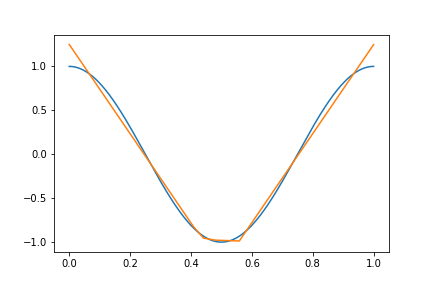
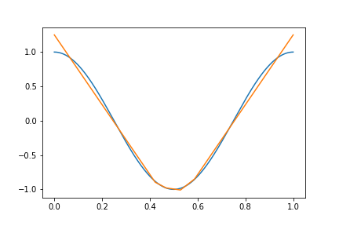

## Universal Approximation Simulation

Universal approximation theorem is baseline theorem of deep neural network states that neural network can approximate any continuous function on compact subsets of $R^{n}$ under certain conditions. In that, neural network can be universal approximator of complex functions. In this repository, I constructed one layer neural network and approximated well known function $cos(2\pi x), sin(2\pi x), sin(x)$. In that process, I found approximation result is highly dependent on the setting. Especially, number of neurons, number of iterations, learning rate and initial value affect loss convergence and approximation. Therefore, I experimented many times to get some results

### $cos(2\pi x)$ approximation

Setting
* Number of data = 1000
* Number of neurons = 30
* Number of iterations = 10000 
* Learning rate = 0.1
* Activation function = ReLU 

  

### $sin(x)$ approximation

Setting
* Number of data = 1000
* Number of neurons = 30
* Number of iterations = 10000 
* Learning rate = 0.1
* Activation function = ReLU

  

