## Universal Approximation Simulation

Universal approximation theorem is baseline theorem of deep neural network states that neural network can approximate any continuous function on compact subsets of n-dimensions under certain conditions. In that, neural network can be universal approximator of complex functions. In this repository, I constructed one layer neural network and approximated well known functions. In that process, I found approximation result is highly dependent on the setting. Especially, number of neurons, number of iterations, learning rate and initial value affect loss convergence and approximation. Therefore, I experimented several times to get some results. Here are the results. You can see decreasing loss as iterations go and final approximation is quite smilar with actual functions.

## cosine function with period 1

### Setting
* Number of data = 100
* Number of neurons = 30
* Number of iterations = 10000
* Learning rate = 0.01
* Activation function = Sigmoid

  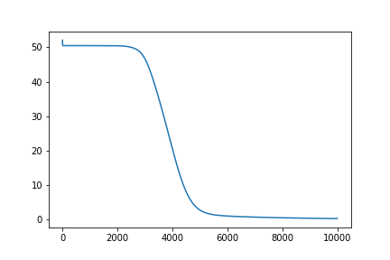
  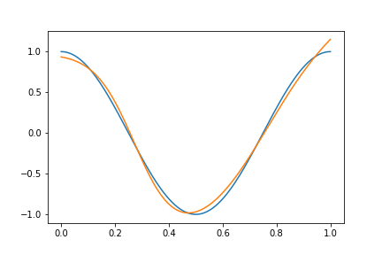

### Setting
* Number of data = 100
* Number of neurons = 30
* Number of iterations = 10000
* Learning rate = 0.01
* Activation function = ReLU

  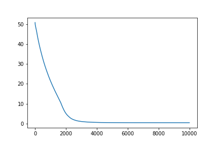
  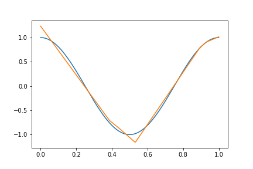

### Setting
* Number of data = 100
* Number of neurons = 30
* Number of iterations = 10000
* Learning rate = 0.01
* Activation function = tanh

  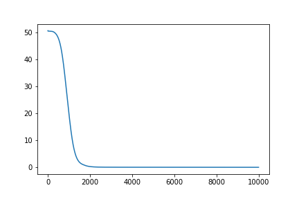
  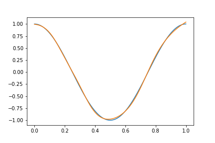

## sine function with period 1

### Setting
* Number of data = 1000
* Number of neurons = 30
* Number of iterations = 10000
* Learning rate = 0.01
* Activation function = Sigmoid

  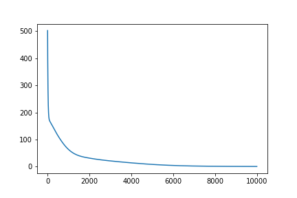
  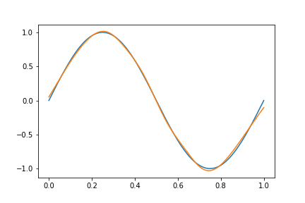

### Setting
* Number of data = 1000
* Number of neurons = 50
* Number of iterations = 10000
* Learning rate = 0.02
* Activation function = ReLU

  
  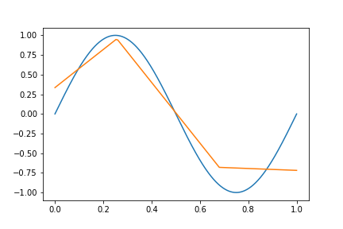

### Setting
* Number of data = 100
* Number of neurons = 30
* Number of iterations = 10000
* Learning rate = 0.01
* Activation function = tanh

  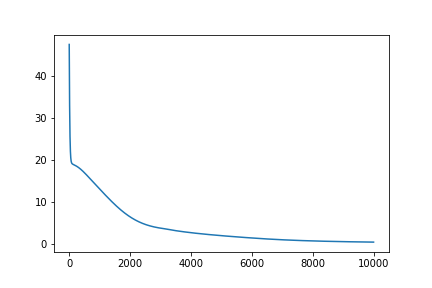
  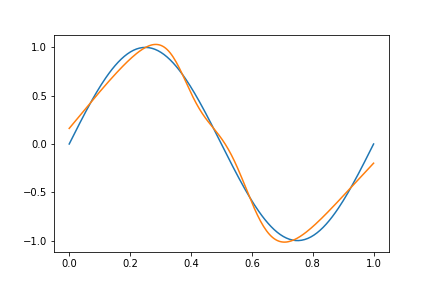

